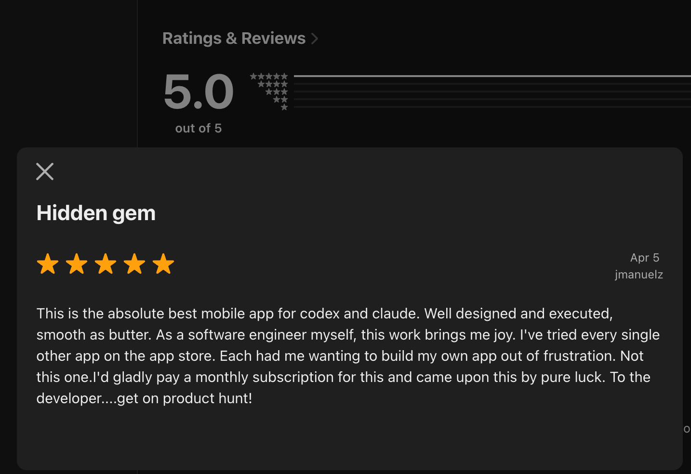

<!-- _class: title -->
<!-- _paginate: false -->

# My AI-driven side project

# passed 500 GitHub stars

## Lessons learned

## Kota Hayashi

  <a href="https://k9i-0.github.io/marp-slides/2026-04-react-native-flutter-meetup/">Japanese version</a>

---

## About me

  

    <h3>Kota Hayashi</h3>
    <ul>
      <li>Company: Yumemi</li>
      <li>Flutter experience: about 5 years professionally</li>
      <li>X: <a href="https://x.com/K9i_apps">https://x.com/K9i_apps</a></li>
    </ul>
  

  

---

## What I built

  

    <h3>CC Pocket</h3>
    <ul>
      <li><strong>An app for controlling Codex and Claude from a phone</strong></li>
      <li>Built for a native experience, not a terminal UI</li>
      <li>A personal Flutter app</li>
      <li>Released the iOS version on <strong>2026/03/06</strong></li>
    </ul>
  

  

    
    
<a href="https://github.com/K9i-0/ccpocket">GitHub repository</a>

  

---

## App screens

  
  

---

## Early traction

  

| Metric                    | Number         |
| ------------------------- | -------------- |
| GitHub Stars              | **626**        |
| App Store reviews (Japan) | **21 / 4.8**   |
| Google Play reviews       | **10 / 5.0**   |

- A strong start about two months after launch
- The UI/UX feedback has been especially positive
- AI helped me achieve both **speed and polish**

  

  

---

## CC Pocket architecture

  

    

      <strong>Mobile / macOS app</strong>
      
Flutter / client

    

    
Communicates via WebSocket Devices connect through Tailscale, etc.

    

      <strong>Bridge server</strong>
      
Self-hosted on Mac / TypeScript

      
Manages Codex / Claude sessions

    

    

      
Registers device tokens Sends notifications via FCM

      

        <strong>Firebase / FCM</strong>
        
TypeScript / notifications

      

    

  

  

    <ul>
      <li>Run the Bridge on a Mac to control Codex / Claude</li>
      <li>Connect from a phone to operate AI sessions remotely</li>
      <li>Use Firebase only for notifications</li>
    </ul>
  

---

## Why Flutter

  <ul>
    <li>I had built SwiftUI macOS apps, React Ink TUI tools, and more with AI-driven development</li>
    <li>They looked good and got some early attention on social media</li>
    <li>But the UX was not polished enough, so I stopped using them myself</li>
  </ul>
  <ul>
    <li>To ship quality, <strong>you need both AI and real understanding of the chosen technology</strong></li>
    <li><strong>I put familiar Flutter at the center of the product</strong></li>
    <li>For surrounding pieces like the Bridge, I used TypeScript</li>
  </ul>

---

## AI tools I used

| Tool        | Main role                                          |
| ----------- | -------------------------------------------------- |
| Claude Code | Early design, implementation, environment setup    |
| Codex       | Current main tool, from design through coding      |
| Antigravity | Final UI polish and asset generation               |

- I did not rely on a single tool; I **used each one for its strengths**

---

## Main development: Claude Code and Codex

- I used AI for almost everything: design, implementation, and environment setup
- Early on, I used **Claude Code**
- Now I have mostly moved to **Codex**
- Model quality is good enough for practical use in both cases

Plan history:

1. Claude Max $100
2. Claude Max $100 + Codex Plus $20
3. Claude Pro $20 + Codex Pro $100
4. Codex Pro $100

---

## Why Codex is my main tool now

- The biggest reason is **cost performance**
- In my workflow, at the same price range, **Codex gave me more usage headroom**

### A major difference: tolerance for third-party tools

- Codex: subscription tokens can be used from third-party tools
- Claude: third-party usage became a terms-of-service violation

Third-party tools include OpenClaw, OpenCode, and CC Pocket itself

---

## Antigravity handled design

- The **multimodal strength** of Gemini-family models feels important here
- The generated code quality is low
- But if you think of it as a **designer who can write a little code**, it is very capable
- It was especially useful for app icons, generated assets, and final UI adjustments

Antigravity contributed a lot to the positive feedback on CC Pocket's UI/UX

- By the way, being from Google does not make it magically better with Flutter...

---

## Supporting tech that worked well with AI

- **shorebird**
  Easy remote device testing and convenient OTA-style updates
- **marionette mcp**
  Important for letting AI verify the UI by itself
- **BLoC**
  Easier for AI to handle than overly flexible state management
- **GitHub Actions**
  Easy for AI to automate because errors are available through CLI and API

I will cover these in the following slides

---

## shorebird

- [https://shorebird.dev/](https://shorebird.dev/)
- An OTA (Over The Air update) tool for Flutter
- Lets you release without app store review
  - Avoids losing AI's productivity gains to review delays
- Also useful when you cannot connect directly to a Mac for device testing
  - Much faster than distributing through TestFlight

### OTA support may matter a lot in AI-first development

- Honestly, Expo probably has a better experience in this area

---

## marionette mcp

- [https://pub.dev/packages/marionette_mcp](https://pub.dev/packages/marionette_mcp)
- A Playwright MCP-like tool for Flutter
- In AI-driven development, giving AI ways to verify work is important
  - Feedback loops such as lint, unit tests, and E2E tests
  - Recently this might be called harness engineering?
- More details in these articles and slides
  - [Automate Store screenshots and UI verification with Marionette MCP call_custom_extension](https://zenn.dev/yumemi_inc/articles/20260326_marionette_mcp_call_custom_extension)
  - [Run a UI verification feedback loop for Flutter apps with MCP](https://k9i-0.github.io/flutter_deck_template/fluttergakkai_9/#/title)

---

## BLoC

- Riverpod and BLoC are both popular state management options in Flutter
- With Riverpod, I felt AI-generated code was less stable because the style is very flexible
- After switching to BLoC, state management has been reliable even when I mostly delegate it to AI

My impression is that stricter rules reduce generation stress and fit AI better, though I have not used BLoC deeply enough to make a stronger claim

---

## GitHub Actions

- Because the project is public, using it for free is a big advantage
- Beyond that:
  - Error details are available through CLI and API, so AI can work with them easily
  - When choosing CI/CD tools, avoid services where important information is only visible in the GUI

---

## Summary

- Even in AI-driven development, understanding the chosen technology matters
  - A good balance is to center the product on **technology you know well** while adopting new tools around it
- Claude Code / Codex for main development, Antigravity for design worked well
  - If I had to recommend only one for individual developers, I would recommend Codex
- I also introduced supporting technologies
  - OTA updates and feedback loops are especially important
