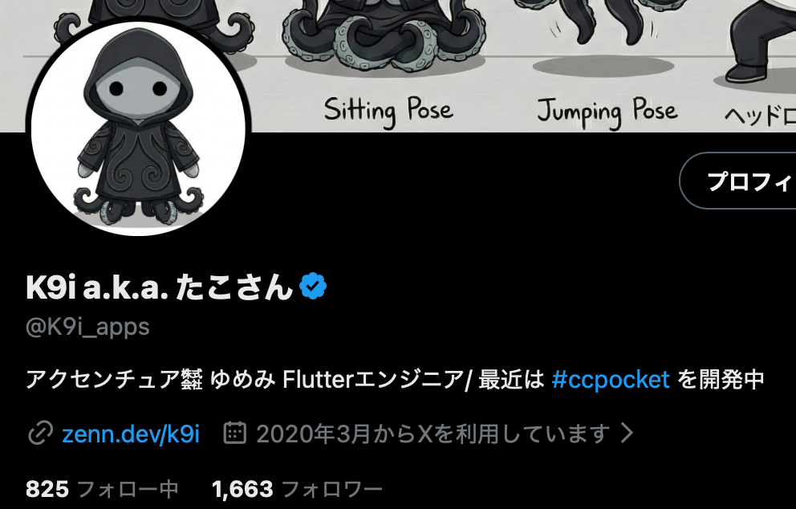
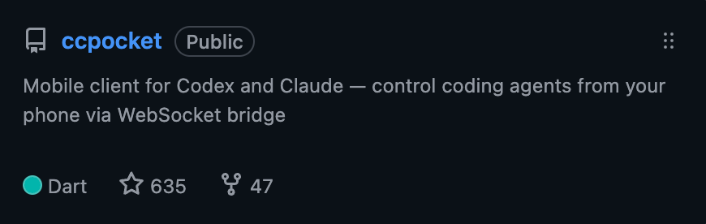
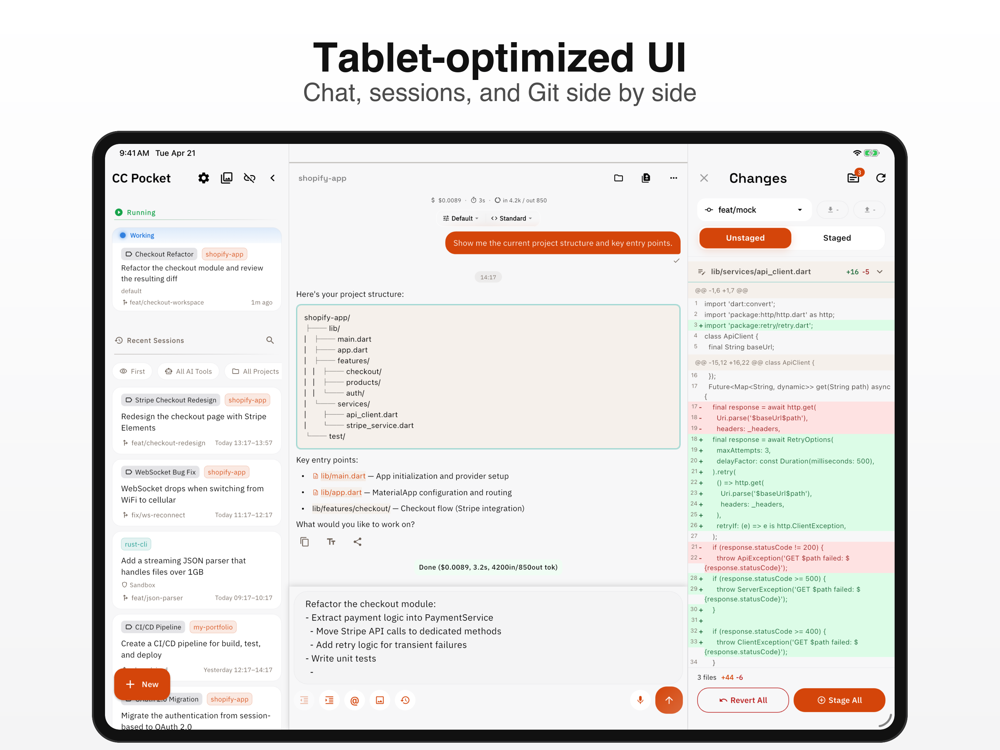
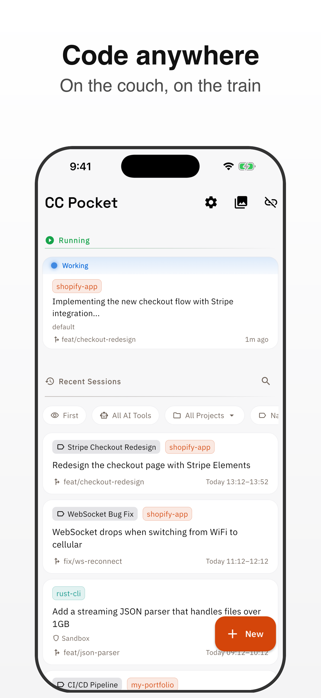

<!-- _class: title -->
<!-- _paginate: false -->

# AI駆動開発した個人アプリが

# 500スター超えたので知見を共有します

## React Native & Flutter Meetup / 2026/04/24

---

## 自己紹介

  

    <h3>Kota Hayashi</h3>
    <ul>
      <li>所属: ゆめみ</li>
      <li>Flutter歴: 業務だと5年くらい</li>
      <li>X: <a href="https://x.com/K9i_apps">https://x.com/K9i_apps</a></li>
    </ul>
  

  

---

## 作ったもの

  

    <h3>CC Pocket</h3>
    <ul>
      <li><strong>Codex や Claude をスマホから操作するためのアプリ</strong></li>
      <li>ターミナルではなく、ネイティブ体験を目指して開発</li>
      <li>Flutter 製の個人開発アプリ</li>
      <li>iOS 版は <strong>2026/03/06</strong> に公開</li>
    </ul>
  

  

    
    
GitHub repository

  

---

## 数字で見る反応

| 指標                 | 数字           |
| -------------------- | -------------- |
| GitHub Stars         | **626**        |
| App Store レビュー   | **21件 / 4.8** |
| Google Play レビュー | **10件 / 5.0** |

- UI/UX の反応がかなり良かった
- 個人開発でも AI を使うと**速度と完成度を両立**しやすい

---

## アプリ画面

  
  

---

## CC Pocket の構成

  

    

      <strong>スマホアプリ</strong>
      
Flutter / クライアント

    

    
WebSocket Tailscale などで接続

    

      <strong>Bridge サーバー</strong>
      
Mac にセルフホスト / TypeScript

      
Codex / Claude のセッションを管理

    

  

  

    <ul>
      <li>スマホから Bridge に接続して、AI セッションを操作</li>
      <li>Bridge は Mac 上で動き、Codex / Claude とやり取りする</li>
      <li>Firebase はほぼ通知用</li>
      <li>Device token は Bridge 経由で登録し、FCM でプッシュ通知</li>
    </ul>
    

      Firebase / FCM はメインの通信経路ではなく、<strong>非同期通知の補助</strong>
    

  

---

## なぜ Flutter で作ったか

  <ul>
    <li>SwiftUI / React Ink なども AI 駆動で作ってきた</li>
    <li>見た目や SNS での初速は良かった</li>
    <li>でも UX が詰めきれず、自分でも使わなくなった</li>
  </ul>
  <ul>
    <li>品質を出すには、AI 活用だけでなく採用技術への理解が必要</li>
    <li><strong>慣れた Flutter をプロダクトの中心に置いた</strong></li>
    <li>一方で Bridge など周辺は TypeScript で作った</li>
  </ul>

---

## 利用した AI ツール

| ツール      | 主な役割                               |
| ----------- | -------------------------------------- |
| Claude Code | 初期の設計、実装、環境構築             |
| Codex       | 現在のメイン。設計から実装まで広く担当 |
| Antigravity | UI の最終ブラッシュアップ、素材生成    |

- 1つに寄せず、**役割ごとに使い分け**た

---

## メイン開発は Claude Code と Codex

- 設計から実装、環境構築まで、ほとんど AI に任せた
- 初期は **Claude Code** を利用
- 現在は **Codex** 中心に移行済み
- モデル性能そのものは、どちらも実用には十分だった

使ったプランの変遷:

1. Claude Max $100
2. Claude Max $100 + Codex Plus $20
3. Claude Pro $20 + Codex Pro $100
4. Codex Pro $100

---

## なぜ今は Codex 中心か

- 一番大きい理由は **コスパ**
- 自分の運用では、同価格帯なら **Codex のほうが利用量に余裕**があった
- 長時間の実装や試行錯誤を回しやすい
- サードパーティツールとの組み合わせも、**運用しやすい感覚**があった

- 比較したかったのは機能差よりも、**日常的に回せるかどうか**

---

## デザイン担当は Antigravity

- Gemini 系の**マルチモーダルの強さ**が効いた
- 生成コードの品質は完璧ではない
- ただし、**コードも少し書けるデザイナー**だと思うとかなり有能
- アプリアイコン等の素材生成や、UI の最終調整で特に役立った

CC Pocket の UI/UX が好評だったのは、かなり Antigravity の貢献が大きい

## AI 駆動で効いた周辺技術

- **marionette mcp**
  UI 検証を AI 自身にやらせるために重要
- **shorebird**
  遠隔でも実機確認しやすく、OTA 的な更新が便利
- **BLoC**
  自由度が高すぎる状態管理より、AI に扱わせやすかった
- **GitHub Actions**
  ワークスペース作成中も API でエラー詳細を拾えて自動化しやすい

AI に書かせるだけでなく、**AI が検証しやすい環境**を作るのが効いた

---

<!-- _class: dark -->

## まとめ

- AI 駆動でも、**使い慣れた技術**を選ぶのはかなり重要
- メイン開発は Claude Code / Codex、デザインは Antigravity の分担がハマった
- 速度だけでなく、**UI/UX の質**も上げやすい
- 個人開発でも、検証基盤まで整えると AI 駆動はかなり現実的

---

<!-- _class: dark -->

## ありがとうございました

CC Pocket と発表資料は後で公開します
