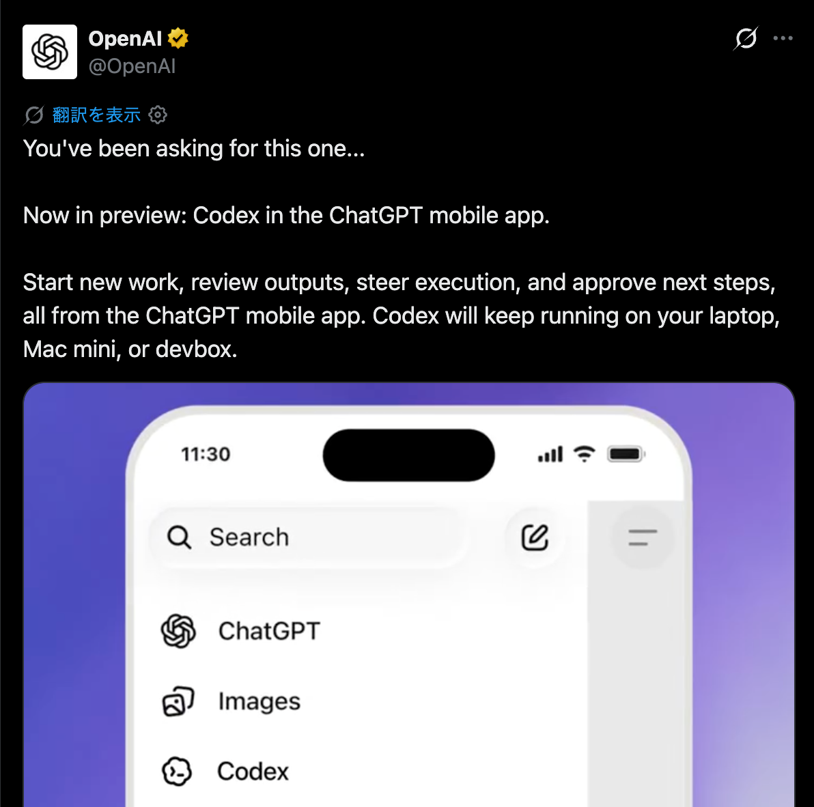

<!-- _class: title -->
<!-- _paginate: false -->

# Codex Appとの

# 連携経路を調べた話

## app-server と remote-control の違い

### Kota Hayashi

---

## 自己紹介

  

    <h3>Kota Hayashi</h3>
    <ul>
      <li>K9i a.k.a. たこさん</li>
      <li>所属: ゆめみ</li>
      <li>Flutter歴: 業務だと5年くらい</li>
      <li>X: <a href="https://x.com/K9i_apps">https://x.com/K9i_apps</a></li>
    </ul>
  

  

    <h3>最近やっていること</h3>
    <ul>
      <li><strong>CC Pocket</strong> を開発中</li>
      <li>Codex / Claudeをスマホから操作するアプリ</li>
      <li>Flutterで iOS / Android / macOS に対応</li>
      <li>GitHub: <a href="https://github.com/K9i-0/ccpocket">K9i-0/ccpocket</a></li>
    </ul>
  

---

## 2つのモバイル体験

  

    
    
CC Pocket: 独自BridgeからCodexを操作

  

  

    
    
公式Codex mobile: ChatGPT mobile appからCodex Appへ

  

---

## CC Pocketは独自app-serverで動いていた

  

    

      <strong>CC Pocket</strong>
      
mobile / desktop app

    

    
↓ WebSocket

    

      <strong>Bridge</strong>
      
自前の中継プロセス

    

    
↓ 起動して接続

    

      <strong>codex app-server</strong>
      
thread / turn / diff / approval

    

  

  

    <ul>
      <li>セッション開始、承認、diff確認などはできる</li>
      <li>Codex操作のリモートUIとしては成立する</li>
      <li>ただし、公式Codex Appとは別世界になる</li>
    </ul>
  

---

## でもCodex Appとは同期しない

- 独自 <code>app-server</code> 方式でもCodex操作はできる
- ただし、公式Codex Appが見ているセッションとは別世界になる
- そこでCodex App内部の <code>app-server</code> に外から入れないか調べた

観測:

- Codex Appは <code>codex app-server</code> をchild processとして起動
- <code>ws://localhost:port</code> のような外部接続口は見つからなかった
- stdio / Unix fd系でアプリ内部から直接つながっているように見えた

  Codex App内部へ後入りする入口ではなさそう

---

## Litterも同じ経路に見える

  

    

      <strong>mobile app</strong>
    

    
↓ authorization

    

      <strong>OpenAI remote-control</strong>
    

    
↓ transport

    

      <strong>Codex App / session</strong>
    

  

  

    <ul>
      <li>LitterはCodex App / 公式側と連携できているように見える</li>
      <li>単純なローカル <code>app-server</code> 接続ではなさそう</li>
      <li>Connections / remote control周辺に乗っていそう</li>
      <li>外部クライアント用の <code>client id</code> が必要そう</li>
    </ul>
  

---

## なのでOpenAIに問い合わせた

- remote-controlにサードパーティアプリが参加してよいか
- 必要な <code>client id</code> や登録手続きはあるか
- 利用できる場合、安定性・認証・サポート範囲はどうなるか

  公開情報だけでは判断できないので確認中

---

<!-- _class: dark -->

## まとめ

- CC Pocketの独自 <code>app-server</code> 方式ではCodex操作はできる
- ただし、公式Codex Appとは同期できない
- Codex App内部の <code>app-server</code> に後から接続する方法は見つからなかった
- 公式mobileやLitterは <code>remote-control</code> 経路に乗っている可能性が高い
- <code>client id</code> が必要そうなのでOpenAIに問い合わせ中
