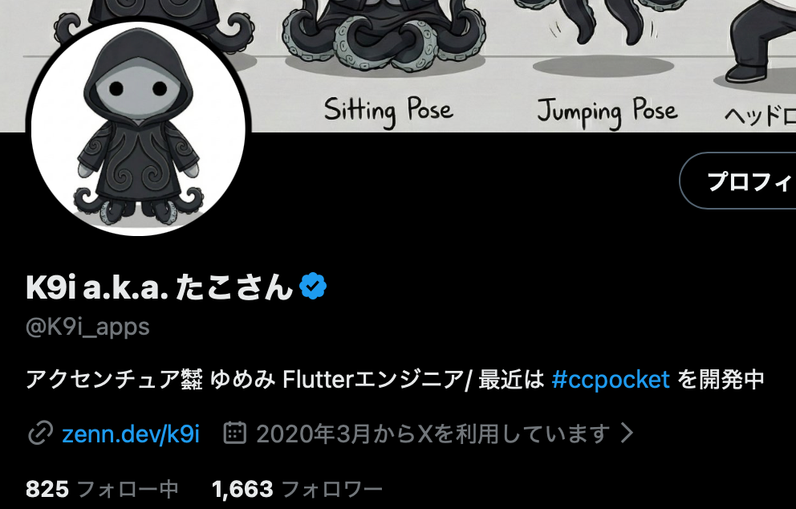
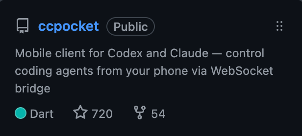
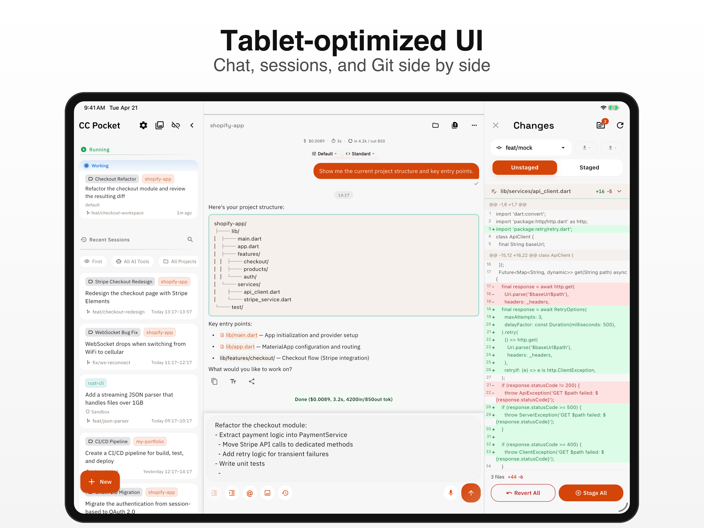
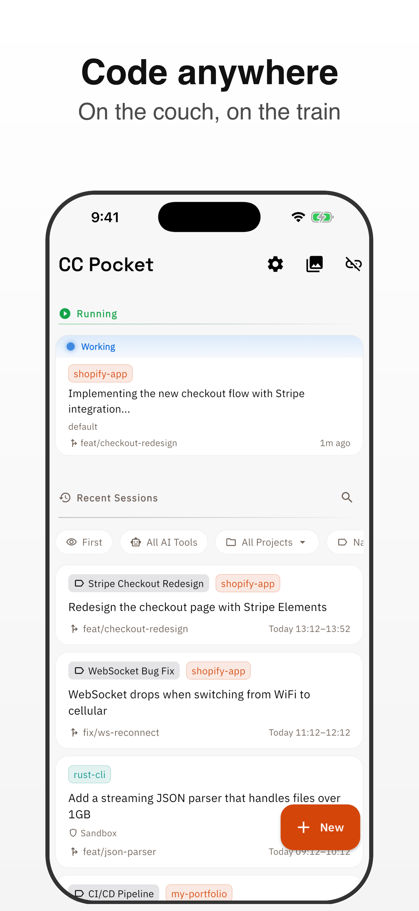

<!-- _class: title -->
<!-- _paginate: false -->

# Marionette MCPのススメ

## 完全にエージェント任せでFlutter開発したときの知見共有

### Kota Hayashi

---

## 自己紹介

<div style="display: grid; grid-template-columns: 1fr 44%; gap: 40px; align-items: center;">
  <div>
    <h3>Kota Hayashi</h3>
    <ul>
      <li>K9i a.k.a. たこさん</li>
      <li>所属: ゆめみ</li>
      <li>Flutter歴: 業務だと5年くらい</li>
      <li>X: <a href="https://x.com/K9i_apps">https://x.com/K9i_apps</a></li>
    </ul>
  </div>
  
</div>

---

## 最近やっていること

<div style="display: grid; grid-template-columns: 1fr 260px; gap: 36px; align-items: start;">
  <div>
    <h3>CC Pocket</h3>
    <ul>
      <li><strong>Codex や Claude をスマホから操作するためのアプリ</strong></li>
      <li>AI駆動開発の検証も兼ねた個人開発プロジェクト</li>
      <li>Flutterで iOS / Android / macOS に対応</li>
      <li>コードはすべてエージェントに書かせている</li>
    </ul>
  </div>
  <div style="text-align: center;">
    
    <p style="margin: 10px 0 0; font-size: 0.68em;"><a href="https://github.com/K9i-0/ccpocket">GitHub repository</a></p>
  </div>
</div>



---

## アプリ画面

<div style="display: grid; grid-template-columns: 1fr 280px; gap: 22px; align-items: center; margin-top: -8px;">
  
  
</div>

---

## CC Pocketの反応

| 指標                 | 数字           |
| -------------------- | -------------- |
| GitHub Stars         | **720**        |
| App Store レビュー   | **31件 / 4.8** |
| Google Play レビュー | **14件 / 5.0** |

- 完全にエージェントにコードを書かせてもユーザーが満足する品質にできる
- 重要だったのは **AI自身に検証させる仕組み**

---

## CC Pocketでの開発プロセス

<div style="display: grid; grid-template-columns: 1fr 1fr; gap: 36px; align-items: start;">
  <div>

1. 下調べ
   1. 実装に十分なコンテキストの取得
2. プラン
   1. おかしいところはここで軌道修正
   2. 複雑な機能では、実装前に **どう検証するか** まで計画させる
3. 実装
   1. 丸投げ

  </div>
  <div>

<ol start="4">
  <li>フィードバックループ</li>
  <li>人手でチェック</li>
  <li>必要なら前のステップへ戻る</li>
</ol>

  </div>
</div>

---

## AI駆動開発で一番効いたこと

# フィードバックループを作る

<div style="font-size: 0.9em;">

- lint
- unit test
- セルフレビュー
- 実機 / シミュレータでのUI確認

</div>

AIに「実装」だけでなく、**確認して直すところまで任せる**

---

## Flutterでのフィードバックループ

- lint, unit testはこれまでの開発の延長。実装完了後にpassさせるようにメモリ（AGENTS.md等）で指示。強制するならhooks
- セルフレビュー
  - サブエージェントでクリアなコンテキストウィンドウを使わせたり、別のモデルを使ってコードレビューさせる
  - PRレビューでやってたことをローカルで行う
- UI検証
  - 実際にシミュレーターでUIを操作させる
  - Marionette MCP
    - 他にも選択肢があるが個人的におすすめ

---

## Marionette MCP

LeanCode が開発している Flutter 特化のMCP

https://pub.dev/packages/marionette_mcp

| MCP                         | 主な用途                                 |
| --------------------------- | ---------------------------------------- |
| Dart and Flutter MCP server | エラー取得、コード分析など開発時の支援   |
| Marionette MCP              | タップ、入力、スクショなどランタイム操作 |

どちらか一方ではなく、**併用する**ツール

---

## Marionette MCPでできること

| 操作                   | 例                         |
| ---------------------- | -------------------------- |
| UIツリーの取得         | ボタンやテキストを探す     |
| タップ / 入力          | 実際に画面を操作する       |
| スクリーンショット     | 見た目を確認する           |
| カスタム操作の呼び出し | アプリ固有の導線を短縮する |

Flutter向けの「AIに目と手を渡す」道具
Webで有名なPlaywright MCPのポジション

---

## Marionette MCPの使い所

- UIが絡む既存機能改修
  - 計画段階でUI操作しての検証まで提案させる
- 人手でのチェックフェーズでバグが見つかったとき
  - バグがe2eで直ることが確認できることをゴールにする

付きっきりで見守る場合より時間はかかるが、AIにかなりお任せできるようになる

---

## 推し機能 call_custom_extension ツール

**アプリ側にAI専用の操作口を用意できる**

| ツール                   | 役割                               |
| ------------------------ | ---------------------------------- |
| `list_custom_extensions` | 登録済みエクステンション一覧を取得 |
| `call_custom_extension`  | エクステンションを実行             |

VM Service Extension を MCP 経由で公開する仕組み

Marionette MCP本体のツールセットを小さく保ちつつ、  
アプリ固有の操作を後から足せる「エスケープハッチ」

---

## call_custom_extension できること

- アプリの設定値（言語・テーマなどなど）を extensionから無理やり変更
  - 正規のルートだと設定画面に行ったりが必要で、検証の前段で時間がかかる
- 特定画面に直遷移する extension を利用
  - 階層が深い画面に効率的に遷移

---

## Flutter側の実装イメージ

```dart
registerMarionetteExtension(
  name: 'myApp.goToPage',
  description: 'Navigate to a specific page by name.',
  callback: (params) async {
    final page = params['page'];
    if (page == null) {
      return MarionetteExtensionResult.invalidParams('Missing: page');
    }

    navigateTo(page);
    return MarionetteExtensionResult.success({
      'page': page,
      'status': 'navigated',
    });
  },
);
```

`name` / `description` / `callback` がAI向けのインターフェイスになる

---

## 戻り値でAIに結果を伝える

| 戻り値          | 使いどころ                       |
| --------------- | -------------------------------- |
| `success`       | 操作が成功した                   |
| `invalidParams` | 引数が足りない、値が不正         |
| `error`         | 画面状態などの理由で実行できない |

AIが次の行動を決めやすいように、  
エラーも人間向けではなく **機械が読める結果** として返す

---

## 初期化

```dart
void main() {
  if (kDebugMode && !kIsWeb) {
    MarionetteBinding.ensureInitialized();
    registerMyExtensions();
  } else {
    WidgetsFlutterBinding.ensureInitialized();
  }

  runApp(const App());
}
```

`kDebugMode` でガードするので、リリースビルドには影響しない

---

## CC Pocketで登録している操作

| エクステンション                   | 用途                             |
| ---------------------------------- | -------------------------------- |
| `ccpocket.navigateToStoreScenario` | Storeスクショ用画面へ直接遷移    |
| `ccpocket.navigateToMockScenario`  | UI検証用モック画面へ遷移         |
| `ccpocket.setTheme`                | light / dark / system の切り替え |
| `ccpocket.setLocale`               | en / ja / zh の切り替え          |
| `ccpocket.popToRoot`               | ホーム画面に戻す                 |

「AIが迷いやすい導線」をアプリ側からショートカットする

---

## 自動化フロー

```text
1. ccpocket.setTheme でライトテーマに設定
2. ccpocket.setLocale で言語を設定
3. ccpocket.navigateToStoreScenario でシナリオに遷移
4. 描画完了を待つ
5. xcrun simctl io booted screenshot で撮影
6. ccpocket.popToRoot でホームに戻す
7. 3-6 を全シナリオ分繰り返す
```

手動で各画面へ遷移して撮っていた Store 画像を、  
今はコマンド一発で全シナリオ分生成している

---

## AIに渡すプロンプト例

```text
Marionette MCPを使って実機確認してください。

まず list_custom_extensions で使える操作を確認し、
ccpocket.navigateToMockScenario で対象画面に移動してください。

スクリーンショットを撮り、文字切れ・はみ出し・
タップできない要素がないか確認してください。
問題があれば修正して、同じ確認を再実行してください。
```

「検証して」と言うだけでなく、**検証手段を指定する**

---

## 使いやすくするコツ

- 名前は具体的にする
  - `goToPage` より `ccpocket.navigateToStoreScenario`
- アプリ名をプレフィックスに入れる
- `description` はAIに書かせてもだいたい良い感じになる
- 成功時 / 失敗時の戻り値を機械的に読める形にする
- Claude Code のスキル等に「このエクステンションを使え」と明記する

登録するだけでなく、**AIが適切に使える導線**まで用意する

---

## まとめ

- AI駆動開発で重要なのは、実装よりも **検証のフィードバックループ**
- FlutterのUI検証には Marionette MCP が便利
- `call_custom_extension` でAIが迷う操作をショートカットできる
- AI向けの操作口を用意すると、品質と速度の両方が上がる

---

## ありがとうございました

Marionette MCP、ぜひ試してみてください

https://pub.dev/packages/marionette_mcp
